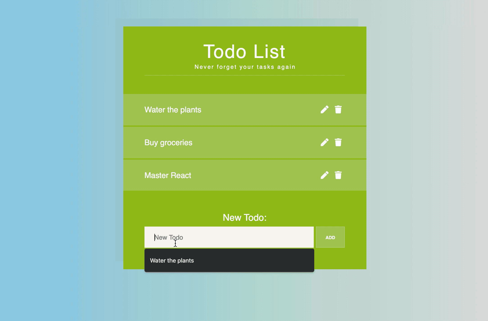
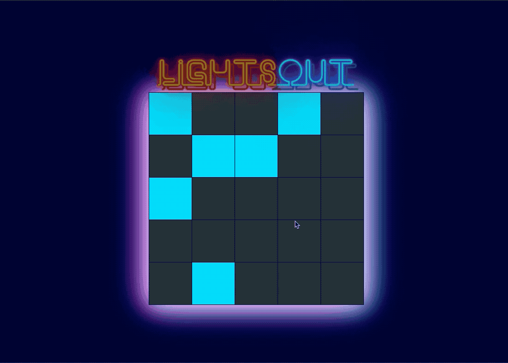
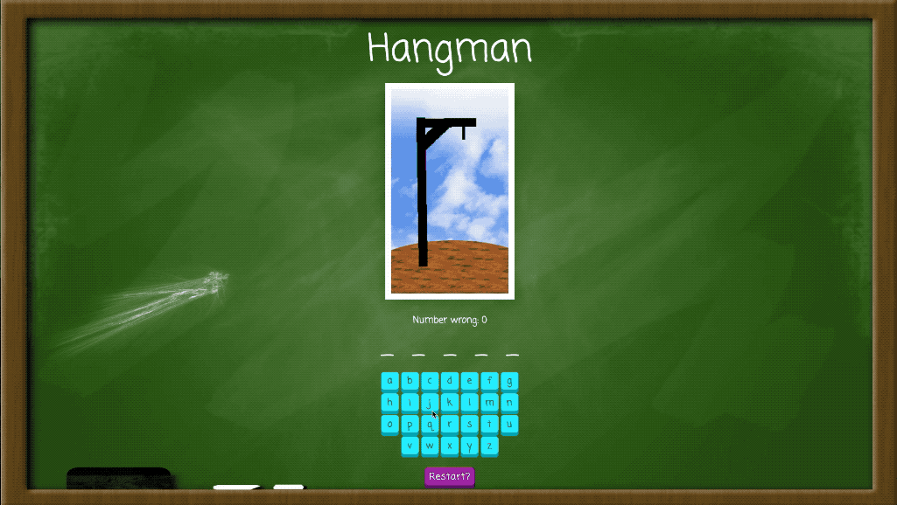
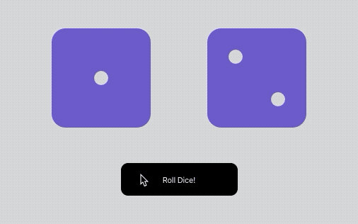
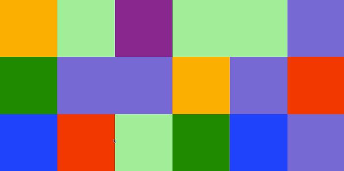

# React Practice Apps

These are the apps I've made while improving my skills in react. Enjoy!

## Yahtzee

Play a game of Yahtzee! The goal is to get as many points as possible by rerolling dice for certain combinations.

## Todo List

This application lets you store your tasks in a convenient todo list, edit your tasks, and mark them for completion.

## Lights Out

The goal of lights out is to turn off all the lights in the grid. Clicking a light flips it and the lights adjacent to it. Good luck!

## Hangman

Play a game of hangman in your browser!

## Roll Dice

Component that rolls an animated pair of dice.

## Color boxes

Component that holds a set of boxes that you can click to change their color.

## Pokegame

A simple webpage that pits two random hands of Pokemon cards against each other, determining the winner based on experience.

